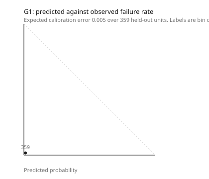
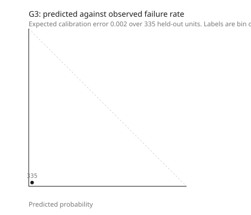

# Evaluation report

**Generated:** 2026-08-29T20:13:44.089868+05:30
**Code version:** 2e1057a
**Line:** line2
**Simulated data.** Every number in this document comes from a simulator this
team wrote. None of it is plant data, and Section 10 says what that costs.

## 1. What was run

| Property | Value |
|---|---|
| Scenarios | SC-01, SC-02, SC-03, SC-04, SC-05, SC-06, SC-07, SC-08 |
| Seeds | 20260302, 20260303, 20260304 |
| Runs | 24 |
| Units released per run | 620 |
| Forecast replications | 40 |
| Forecast horizon | 120 min |
| Forecast cadence | 300 s |
| Defect models trained on | 2400 units, seed 20260301 |

TEST_PLAN.md Section 9 specifies 8 scenarios by 20 seeds at 200 replications.
This run is the same harness at 3 seeds and
40 replications, which is what fits in a `make evaluate` a
person will actually wait for. The full run is T-130 in Phase 5. Nothing else
differs: the same pipeline, the same outcome rules, the same ground truth.

## 2. Against the targets in PRD Section 5

Counts in brackets are the denominators. A ratio without its denominator is not a
measurement, and several of these denominators are small.

| Metric | Target | Measured | Verdict |
|---|---|---|---|
| Stall forecast lead time (median) | 20 to 40 min | 5.0 | below target |
| Stall forecast precision | >= 0.70 | 0.250 (132) | below target |
| Stall forecast recall | >= 0.60 | 0.190 (174) | below target |
| False stall alarms on a quiet shift | <= 1 | 0.70 | met |
| Defect risk PR-AUC | >= 0.55 | 0.036 | below target |
| Defect risk lead time (median) | >= 6 stations | 8.0 | met |
| Calibration error (ECE) | <= 0.05 | 0.005 | met |
| Conformal coverage at alpha 0.10 | >= 0.90 | 0.976 | met |
| Virtual sensor interval coverage | >= 0.90 | 1.000 (73670) | met |

**Beside every figure above: 0.70 false stall alerts per shift on SC-06, over 4.3 shifts.** AC-091 requires that this rate travel
with every accuracy number for the same predictor, and it does so again in each
per-scenario table below. The drift detector's own record over the whole
evaluation is 0.281 (1504) precision and
1.000 (422) recall.

## 3. Per scenario

"Stalls that happened" counts what the twin observed, using the definition in
TECHNICAL_SPEC.md Section 5.1: a five-minute bucket in which a station lost more
than the line's `stall_threshold_s` of production time to blocking or starving.
The forecaster is scored against exactly that quantity, so the two columns are
comparable.

| Scenario | Runs | Shifts | Stalls that happened | Forecasts | Precision | Recall | Median lead | False per shift | Quiet-shift false per shift |
|---|---|---|---|---|---|---|---|---|---|
| SC-01 | 3 | 4.5 | 36 | 134 | 0.264 (53) | 0.389 (36) | 5.0 | 8.72 | 0.70 |
| SC-02 | 3 | 4.3 | 21 | 79 | 0.250 (4) | 0.059 (17) | 90.0 | 0.70 | 0.70 |
| SC-03 | 3 | 4.3 | 21 | 79 | 0.250 (4) | 0.059 (17) | 90.0 | 0.70 | 0.70 |
| SC-04 | 3 | 4.3 | 21 | 79 | 0.250 (4) | 0.059 (17) | 90.0 | 0.70 | 0.70 |
| SC-05 | 3 | 4.3 | 18 | 81 | 0.000 (6) | 0.000 (17) | not measurable | 1.39 | 0.70 |
| SC-06 | 3 | 4.3 | 21 | 79 | 0.250 (4) | 0.059 (17) | 90.0 | 0.70 | 0.70 |
| SC-07 | 3 | 4.3 | 21 | 79 | 0.250 (4) | 0.059 (17) | 90.0 | 0.70 | 0.70 |
| SC-08 | 3 | 4.5 | 36 | 134 | 0.264 (53) | 0.389 (36) | 5.0 | 8.72 | 0.70 |

## 4. The stall forecaster in full

| Outcome | Count |
|---|---|
| Predictions made | 744 |
| Published (predictor `ACTIVE` for that station) | 0 |
| True positive | 33 |
| False positive | 99 |
| Unscoreable | 612 |
| Stalls with nothing in scope (`missed_event`) | 141 |

Lead time, over the true positives only:
p10 5.0 min,
median 5.0 min,
p90 90.0 min.

**On the unscoreable share.** 0.823 of
predictions could not be scored either way. Three things put a prediction here: a
window that ran past the end of the recorded run, a window that opened after the
last unit was released and the line was draining, and a window that fell inside a
shift break (EC-11, EC-46). None of them is a wrong forecast and none of them is a
right one, and counting them either way would corrupt the rate above.

**On recall.** The denominator is the true positives plus the `missed_event`
rows, and those rows exist because a scorecard built from predictions alone can
only say how often the twin was right when it spoke (T-059, EC-26). If this
report showed precision alone, a forecaster that made one correct prediction a
week would look perfect.

## 5. The drift detector

Both the exponentially weighted chart and the cumulative sum chart have to signal
before a drift is emitted (TECHNICAL_SPEC.md Section 5.3). The onset comes from
the cumulative sum: the last instant the relevant sum was zero.

| Scenario | Drifts emitted | Precision | Median onset lag (min) |
|---|---|---|---|
| SC-01 | 269 | 0.288 (191) | 35.1 |
| SC-02 | 265 | 0.278 (187) | 34.7 |
| SC-03 | 267 | 0.277 (188) | 34.9 |
| SC-04 | 265 | 0.278 (187) | 34.7 |
| SC-05 | 264 | 0.280 (186) | 34.7 |
| SC-06 | 265 | 0.278 (187) | 34.7 |
| SC-07 | 265 | 0.278 (187) | 34.7 |
| SC-08 | 269 | 0.288 (191) | 35.1 |

Over the whole evaluation: 0.281 (1504) precision,
625 unscoreable.

**On the onset lag.** It is the time between a drift starting and both charts
agreeing that it had. For a step change it is short, which is what AC-014 asks
about. For a ramp it is necessarily longer, because the first part of a ramp is
indistinguishable from noise by construction: a chart tuned to catch a one-sigma
shift cannot catch a shift that has not yet reached one sigma. SC-01 ramps S20
over 90 minutes and the lag reflects that rather than a fault in the detector.

**On the precision.** A control chart pair tuned to a one-sigma shift signals on
an in-control process every few hundred cycles by construction. Across 42
stations and three variants that is several a shift, and they are what the false
positives here are. This is why the drift detector's slope is not fed to the
forecaster unless the movement is at least as large as the station's own noise
(`DriftEstimate.is_material`), and why the trust ledger keeps a predictor in
shadow at a station where it behaves like this.

## 6. The defect models

One LightGBM classifier per gate, split temporally, calibrated by isotonic
regression on a held-out fold, with split conformal intervals at alpha 0.10.

| Gate | State | Base rate | PR-AUC | ECE | Conformal coverage | Held-out units | Median lead (stations) | Median lead (min) |
|---|---|---|---|---|---|---|---|---|
| G1 | fitted | 0.0168 | 0.114 | 0.005 | 0.983 | 359 | 12.0 | 12.0 |
| G2 | not fitted | 0.0127 | not measurable | not measurable | not measurable | 0 | 8.0 | 8.0 |
| G3 | fitted | 0.0160 | 0.036 | 0.002 | 0.976 | 335 | 13.0 | 13.0 |

- **G1**: fitted on 1074 units, calibrated on 358, tested on 359. Calibration error 0.005, conformal coverage 0.983
- **G2**: G2 has 10 failures in its training fold, below the 12 a model needs. Every unit is scored at the gate's base rate until there are more
- **G3**: fitted on 1003 units, calibrated on 335, tested on 335. Calibration error 0.002, conformal coverage 0.976

**On the split.** It is temporal and never random. A random split leaks the
future through shared part lots and shared drift episodes, and the resulting
number cannot be reproduced in a plant. `Split.leaks` asserts that no unit spans
a fold boundary.

**On the rows the model is fitted on.** A unit's training row is the row it was
actually scored on, taken at the moment the prediction was made and labelled when
the verdict arrived. Rebuilding the row at gate time would fit the model on a
complete route and then ask it to predict from half of one.

## 7. Virtual sensors at the dark stations

Six of the 42 stations emit nothing. The twin bounds them from the flanking
scans, and this is the check that those bounds hold. It is the one place in the
evaluation that reads the simulator's ground truth, and it reads it after the
twin has produced every bound it is going to produce.

| Scenario | Per-station coverage | Per-span coverage |
|---|---|---|
| SC-01 | 1.000 (9190) | 0.999 (1838) |
| SC-02 | 1.000 (9215) | 0.998 (1843) |
| SC-03 | 1.000 (9215) | 0.998 (1843) |
| SC-04 | 1.000 (9215) | 0.998 (1843) |
| SC-05 | 1.000 (9215) | 0.995 (1843) |
| SC-06 | 1.000 (9215) | 0.998 (1843) |
| SC-07 | 1.000 (9215) | 0.998 (1843) |
| SC-08 | 1.000 (9190) | 0.999 (1838) |

Overall: 1.000 (73670) of individual station
bounds contained the truth, and
0.998 (14734) of whole-span bounds did.
The per-station figure is the higher of the two by construction, because on a
span of several dark stations each station's own bound is the span's bound
widened by what the others could plausibly have taken, and every one of those is
reported `UNRESOLVED` rather than as a cycle time.

## 8. Performance

| Measure | Value |
|---|---|
| Forecast cycles run | 3552 |
| Median forecast wall time | 3.06 s |
| 95th percentile | 4.70 s |
| Replications per cycle | 40 |
| Same, scaled to the 200 replications NFR-01 specifies | 23.5 s |

NFR-01 asks for a full forecast in under 20 s. The scaled figure is linear in the
replication count, which the kernel is, and it is an estimate rather than a
measurement of a 200-replication run.

## 9. Reproducibility

| Check | Result |
|---|---|
| Two runs of the same scenario and seed produce the same ledger | yes |
| Detail | 2252 predictions, 2252 outcomes and 12 missed events identical across two runs |
| Code version | 2e1057a |
| Seeds | 20260302, 20260303, 20260304 |

AC-103. Every stochastic draw in the simulator and in the forecaster comes from a
generator seeded on the identity of the draw rather than on a running stream, so
a run reproduces on another machine and a scenario differs from its control only
where it was injected.

## 10. What this evaluation does not establish

Written in the harness's own words, because the alternative is a reader having to
work it out.

**1. The simulator and the twin were written by the same team.** Every number
above measures the twin against a model of a plant, not against a plant. Where
the simulator is wrong in the same direction the twin is wrong, the error is
invisible here. This is the largest gap in the whole verification story and no
amount of additional simulated data closes it. The next step that would is a
recorded historian export from a real line, and it is T-152.

**2. A stall on this line is mostly an unpredictable event.** 21 stalls
occurred across the quiet-shift runs, on a line where nothing was injected. They
are the tail of the repair time distribution: a station goes down for longer than
usual and the stations around it lose a few minutes. A discrete-event forecast
seeded from the current state cannot foresee a random failure, and it should not
be credited with doing so. What it can see is a station that has drifted over
takt, and what that produces on this line is a steady loss of output rather than
a discrete stall. Section 2 reports the stall figures as measured; Section 3
shows that the fault scenarios roughly double the stall count, which is the size
of the effect there is to predict.

**3. The lead time is measured on the true positives only.** That is the
convention, and it flatters any forecaster: the predictions that were wrong had a
lead time too. The distribution in Section 4 is over
33 predictions.

**4. The defect models are fitted on one long baseline run.** A gate that fails
one unit in seventy needs thousands of units before it has enough failures to fit
on, so the models are trained ahead and shipped, which is what a plant does
(NFR-05). It does mean the models have not been tested against a plant whose
behaviour changed after they were fitted, which is the failure mode US-044 exists
for and which the model-health view is meant to catch.

**5. The evaluation covers one line.** `config/lines/line7.yaml` exists to show
that onboarding is a configuration change, and it carries its own scenario, but
the numbers above are Line 2 only. Its `stall_threshold_s` has not been
calibrated against its own physics the way Line 2's has, and should be before any
figure is quoted for it.

**6. Nothing here measures whether a supervisor would act.** Every metric in this
document is about the prediction. Whether the action list is readable at three
metres, whether the calm state reads as calm, and whether a floor comes to trust
the scorecard are questions this harness cannot ask.

**7. The unscoreable share is real and it is reported rather than hidden.**
0.823 of predictions fell inside a data gap, a
shift break, or the drain at the end of a terminating run. On a continuously
running plant the last of those does not exist, so this share would be lower
there, which means it is a pessimistic figure rather than a flattering one.
